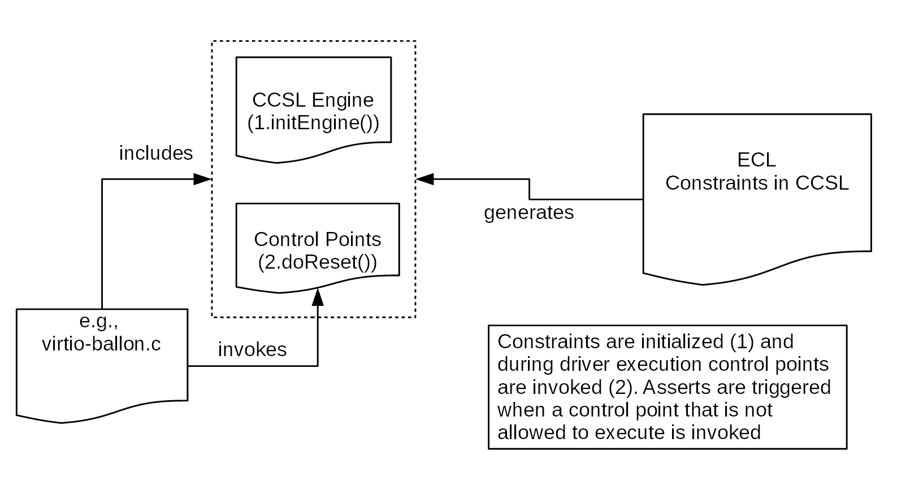

# Virtioml


## Introduction

VIRTIO Modeling Language (VirtIOML) is a set of tools to model the VirtIO specification, which is a common interface for virtual devices and drivers. You can find more information about the specification at https://docs.oasis-open.org/virtio/virtio/v1.1/cs01/virtio-v1.1-cs01.htm. 

The VirtIO specification relies on the notion of **virtqueues** which are the memory structures used by devices and drivers to interact. For example, a virtio network card device has two virtqueues: one for transmits packets and one for receives packets. The guest enqueues packets into the transmission virtqueue and the host dequeues packets from this virtqueue and it sends them over the network.  

To represent the concept of virtqueue, we propose the use of a metamodel. The virtqueue metamodel is used to build the virtio-device metamodel and the virtio-driver metamodel. By relying on these metamodels, it is possible to model virtio-devices and virtio-drivers. To illustrate the use of these metamodels, we model the **virtio-ballon** device and driver.

**Note that the this work is exploratory!** It is still not clear the benefits and drawbacks of the use of modeling tools for VirtIO. The idea is that these tools may allow to:

- generate documentation, e.g., Latex
- generate headers for different languages, e.g., c, rust
- generate source code sketch for drivers and devices in different languages, e.g., c, rust, vhdl, pascal
- generate monitors that check if a device/driver conforms to the specification
- describe formally the behavior of virtqueues to allow simulation and verification

In the following, we first present the different metamodels. Then, at the end of this document, you can find how to try it and contribute to the project.  

## VirtIO Queue Metamodel

The virtqueue metamodel contains concepts and relationships to describe virtqueues. For example, the metamodel specifies that a **virtq** metaclass contains references to the metaclasses: **virtq_desc**, **virtq_availabe** and **virque_used**. Figure 1 illustrates the virtiqueue metamodel.


## Header Generator

The virtqueue metamodel can be used to generate the header in c. For example, the metaclass named **virtq** is translated to the following c structure:

```c
struct virtq {
    struct virtq_avail *avail;
    struct virtq_used  *used;
    struct virtq_desc  *desc;
}
```

The transformation translates references into pointers. Containment references are translated into references. For example, the metaclass **virtq_desc** is translated as follows:
```c
struct virtq_desc {
    QWord addr;
    DWord len;
    Word  flags;
    Word  next;
}
```

The metaclasses **Word**, **DWord**, **QWord** and **Byte** must be manually defined. The generated file can be found at [header.h](https://github.com/MatiasVara/virtioml/blob/master/plugins/org.virtio.model.virtioqueue/headers/virtio-queue.h). The generation is implemented by using a model-to-text transformation in Acceleo. The transformation can be found in the following [link](https://github.com/MatiasVara/virtioml/blob/master/plugins/org.virtio.model.virtqueue.generator/src/org/virtio/model/virtqueue/generator/main/generate.mlt). This transformation can be adapted to generate the header for a different target language, e.g., Rust. 

## VirtIO Device Metamodel

The virtio-device metamodel contains the concepts and relationships to describe virtio-devices. The **virtio-device** metaclass is the core of the description. It contains an **Id** that identifies the virtio-device. **QueuesNr** contains the number of queues the device exposes to the driver.  Figure 2 illustrates the metamodel.  The virtio-device metaclass also contains a set of methods that changes the value of the **DeviceStatus** register. These methods are invoked by the driver during the initialization.


## Validation of the Specification

This section illustrates how to validate that a virtio-driver follows the specification. The specification defines the step that a driver must to follow to initialize a device:

```
The driver MUST follow this sequence to initialize a device:

1) Reset the device.
2) Set the ACKNOWLEDGE status bit: the guest OS has noticed the device.
3) Set the DRIVER status bit: the guest OS knows how to drive the device.
4) Read device feature bits, and write the subset of feature bits understood by the OS and driver to the device. During this step the driver MAY read (but MUST NOT write) the device-specific configuration fields to check that it can support the device before accepting it.
5) Set the FEATURES_OK status bit. The driver MUST NOT accept new feature bits after this step.
6) Re-read device status to ensure the FEATURES_OK bit is still set: otherwise, the device does not support our subset of features and the device is unusable.
7) Perform device-specific setup, including discovery of virtqueues for the device, optional per-bus setup, reading and possibly writing the device’s virtio configuration space, and population of virtqueues.
8) Set the DRIVER_OK status bit. At this point the device is “live”.
```

The steps 1) and 2) can be translated into a temporal relationship between the methods **SetReset()** and **SetAck()**. For example, if we encode this relationship by using the formal language **CCSL** (see https://hal.inria.fr/inria-00384077v2 for further information about CCSL), the statement is translated into the following code:

```
context virtiodevice
   inv ackafterreset : 
     Relation Precedes(self.SetReset, self.SetAck) 
```

In this code, the **ackafterreset** is an **invariant** that specifies that the method **SetReset()** must be invoked before the method **SetsAck()**. 

**TODO**: From this code, it is possible to generate C code to validate that a driver follows the specification. The following picture sketches how this works:



The constrains in CCSL are used to generate two sort of codes:

1. Validation code: This code contains all the temporal constraint and contains a list of methods that are allowed to be invoked in a step of execution. This is illustrated at (1) in the picture.  
2. Instrumentation code: This code is placed into the driver source code to generate the traces. This captures when a method is invoked, e.g., SetReset() This is illustrated at (2) in the picture. 

## Example: Virtio-balloon

- We use the virtio-ballon driver to illustrate the procedure presented above.
- In the case of the virtio-ballon, we want to ensure that the driver sets up the virtqueues before it sets the driver OK device status. 
- This can be specified by the following invariant:
```
context virtiodevice
   inv setvirqueuebeforedriverok : 
     Relation Precedes(self.SetVirQueue, self.SetDriverOK) 
```
- From this invariant, the following code is generated:
```c
static int delta;

static void SetVirtque(void){
    delta++;
}

static void SetDriverOK(void){
    delta--;
    if (delta < 0){
        printk(KERN_ALERT "Invariant SetVirqBeforeDriverOK has been violated\n");
    }
}
```
- TODO: to generate this code.
- I set up the instrumentation code in the following lines of the virtio-ballon.c
- line 526
```c
if (virtio_has_feature(vb->vdev, VIRTIO_BALLOON_F_FREE_PAGE_HINT))
    vb->free_page_vq = vqs[VIRTIO_BALLOON_VQ_FREE_PAGE];
SetVirtque(); // added here
return 0;
```
- line 949
```c
virtio_device_ready(vdev);
SetDriverOK(); // added here
if (towards_target(vb))
    virtballoon_changed(vdev);
return 0;
```

You can check the **dmesg** to see if the invariant has been violated. If that is the case, you are going to get the following message: 

`[    2.537668] Invariant SetVirqBeforeDriverOK has been violated`

## How to Try it

- Download the GEMOC studio
- Clone the repos. 

## How to Contribute

- Create an issue!
