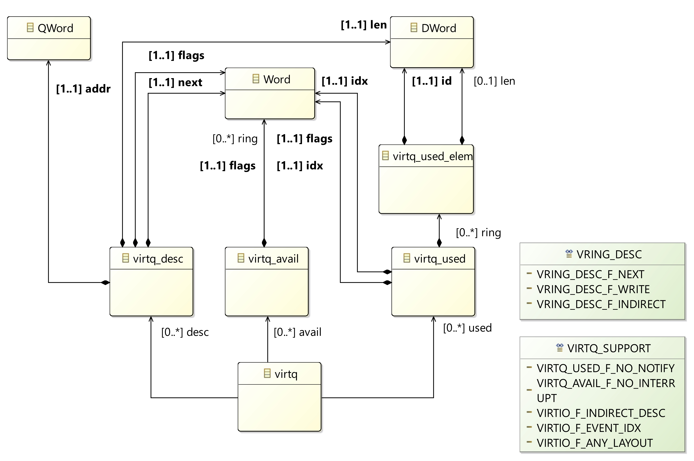

# Virtioml


## Introduction

VIRTIO Modeling Language (VirtIOML) is a set of tools to model the VirtIO specification, which is a common interface for virtual devices and drivers. You can find more information about the specification at https://docs.oasis-open.org/virtio/virtio/v1.1/cs01/virtio-v1.1-cs01.htm. 

The VirtIO specification relies on the notion of **virtqueues** which are the memory structures used by devices and drivers to interact. For example, a virtio network card device has two virtqueues: one for transmits packets and one for receives packets. The guest enqueues packets into the transmission virtqueue and the host dequeues packets from this virtqueue and it sends them over the network.  

To represent the concept of virtqueue, we propose the use of a metamodel. The virtqueue metamodel is used to build the virtio-device metamodel and the virtio-driver metamodel. By relying on these metamodels, it is possible to model virtio-devices and virtio-drivers. To illustrate the use of these metamodels, we model the **virtio-ballon** device and driver.

**Note that the this work is exploratory!** It is still not clear the benefits and drawbacks of the use of modeling tools for VirtIO. The idea is that these tools may allow to:

- generate documentation, e.g., Latex
- generate headers for different languages, e.g., c, rust
- generate source code sketch for drivers and devices in different languages, e.g., c, rust, vhdl, pascal
- generate monitors that check if a device conforms to the specification
- describe formally the behavior of virtqueues to allow simulation and verification

In the following, we first present the different metamodels. Then, at the end of this document, you can find how to try it and contribute to the project.  

## VirtIO Queue Metamodel

The virtqueue metamodel contains concepts and relationships to describe virtqueues. For example, the metamodel specifies that a **virtq** metaclass contains references to the metaclasses: **virtq_desc**, **virtq_availabe** and **virque_used**. Figure 1 illustrates the virtiqueue metamodel.



## Header Generator

The virtqueue metamodel can be used to generate the header in c. For example, the metaclass named **virtq** is translated to the following c structure:

```c
struct virtq {
    struct virtq_avail *avail;
    struct virtq_used  *used;
    struct virtq_desc  *desc;
}
```

The transformation translates references into pointers. Containment references are translated into references. For example, the metaclass **virtq_desc** is translated as follows:
```c
struct virtq_desc {
    QWord addr;
    DWord len;
    Word  flags;
    Word  next;
}
```

The metaclasses **Word**, **DWord**, **QWord** and **Byte** must be manually defined. The generated file can be found at [header.h](https://github.com/MatiasVara/virtioml/blob/master/plugins/org.virtio.model.virtioqueue/headers/virtio-queue.h). The generation is implemented by using a model-to-text transformation in Acceleo. The transformation can be found in the following [link](https://github.com/MatiasVara/virtioml/blob/master/plugins/org.virtio.model.virtqueue.generator/src/org/virtio/model/virtqueue/generator/main/generate.mlt).

## VirtIO Device Metamodel

The virtio-device metamodel contains the concepts and relationships to describe virtio-devices. The **virtio-device** metaclass is the core of the description. It contains an **Id** that identifies the virtio-device. **QueuesNr** contains the number of queues the device exposes to the driver.  Figure 2 illustrates the metamodel.  The virtio-device metaclass also contains a set of methods that changes the value of the **DeviceStatus** register. These methods are invoked by the driver during the initialization.

Based on the VirtIO specification, these methods must be executed in a particular order to ensure the correct initialization of the device. For example, the following text is part of the steps that the driver has to follow to initialize a device: 

```
The driver MUST follow this sequence to initialize a device:

1) Reset the device.
2) Set the ACKNOWLEDGE status bit: the guest OS has noticed the device.
...
```

This statement can be translated into a temporal relationship between the methods **Reset()** and **Ack()**. For example, if we encode this relationship by using the formal language CCSL, the statement is translated to the following code:

```
context virtiodevice
   inv ackafterreset : 
     Relation Precedes(self.Reset, self.Ack) 
```

In this code, the **ackafterreset** is an invariant that specifies that the method **Reset()** must be invoked before the method **Ack()**. From this specification, it possible to generate c monitors to check that a driver correctly initializes a device. If the driver triggers these methods in a different order, an assert is executed. 


## VirtIO Driver Metamodel

- The virtio-driver metamodel contains the concepts and the relationships to model virtio-drivers.
- The root element is the virtiodriver metaclass. This metaclass refers to a virtio-device metaclass.
- This class is imported from the virtio-device metamodel.  


## Example: Virtio-balloon

- To illustrate the use of these metamodels, the repo includes the models of the virtio-balloon device and driver.
- Both models are built independently. 
- To explain how the virtio-ballon work and the used workflow.
- one model of the device
- one model of the driver
- the device has references to virtqueue but the driver has to instantiates during initialization
- the driver trigger the initialization procedure by setting the device status and then setting up the virtqueues.

## How to Try it

- Download the GEMOC studio
- Clone the repos. 

## How to Contribute

- Create an issue!
